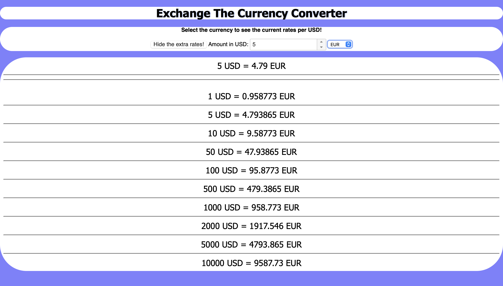

<h1>Projekti 3</h1>

# Project Title 
Exchange The Currency Converter

## Demo link:
Access my site at [google.com](https://google.com)

## How was the workload divided
My work was all done by me.

## Table of Content:

- [About The App](#about-the-app)
- [Screenshots](#screenshots)
- [Technologies](#technologies)
- [Setup](#setup)
- [Approach](#approach)
- [Status](#status)
- [Credits](#credits)
- [License](#license)

## About The App
Exchange The Currency Converter is an app that converts USD to other currencies and you can even choose the amount you want to convert.

## Screenshots

Picture by [Onni Pajarinen]  

## Technologies
Describe which technologies were used and the role of each in your project. 
I used the following technologies `html`, `css`, ...

## Setup
My application is Exchange The Currency Converter and it can convert USD currency to currencies of other countries. It works by entering any number greater than 0 into the box. Then you select a currency from the dropdown menu to which you want to convert dollars. The application also shows some extra exchange rates, but you can hide or unhide them from the button that says "Hide/Show the extra rates!".

## Status
Exchange The Currency Converter is still in progress. `Version 2` will be out soon where there you can convert other currencies to other currencies instead of USD.

## Credits
I asked what should I do from ChatGPT since I didn't know what app should I make. Everything was done by me at the end, ChatGPT helped in some situation where I didn't know what was wrong with my code because it didn't show up right.
- [Onni Pajarinen]
- [Beginners guide to BEM](link-goes-here.com)

## License
MIT license @ [Onni Pajarinen]